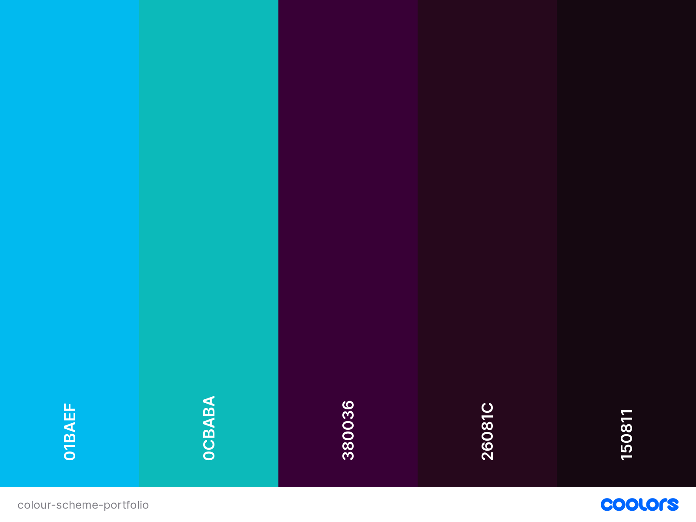

# **Portfolio Website**:   Daniel Kelly *Junior Developer*
## **Description**

Daniel Kelly is a junior developer from Melbourne, Australia. This is a portfolio website intended to showcase Daniel's skills and abilities as a full-stack developer. 

## Links
**Github** https://github.com/danielkellydev/portfoliowebsite

## **Design**

## *Colour Scheme*
 (credit: www.coolors.co)

      
## Credits/References
1. Home page image: Photo by Emile Perron on Unsplash
2. Sweep-to-right animation in navigation menu: https://codepen.io/vxncetxn/pen/GzowEE?editors=0110
3. Colour scheme: www.coolors.co
4. Inspiration for contact form: https://www.youtube.com/watch?v=ceGcS5CAi5s