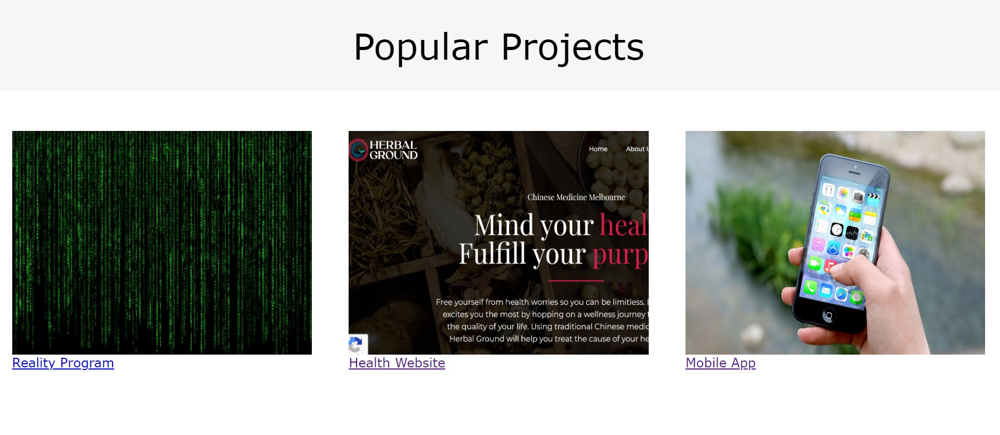

# **Portfolio Website**:   Daniel Kelly *Junior Developer*
## **Description**

Daniel Kelly is a junior developer from Melbourne, Australia. This is a portfolio website intended to showcase Daniel's skills and abilities as an up and coming full-stack developer. It is intended for the viewing of prospective employers, though is suitable for anyone interested in Daniel's work.

## **Tech Stack**
Thus far, the portfolio displays use of HTML and CSS (SCSS).

## **Links**
**Github** https://github.com/danielkellydev/portfoliowebsite
**Website URL** https://www.danielkellydev.netlify.app
**Presentation Video** https://watch.screencastify.com/v/MusyReaLbIBM61yMXRjN

*Sitemap*

## **Design**

## *Colour Scheme*
 (credit: www.coolors.co)

I searched coolors.co and came across the above color scheme. I ended up keeping the website color scheme more simple, and hence only used 01BAEF as primary color and 0CBABA as secondary color. 

## **Functionality/Features**

*Hover animation* 
1. sweep-right color animation has been applied for menu items. This adds an interactive feel when navigating the website. 

2. When the homepage feature tiles are hovered upon, they grow slightly larger and text changes from black to white.

      
## Credits/References
1. Home page image: Photo by Emile Perron on Unsplash
2. Sweep-to-right animation in navigation menu: https://codepen.io/vxncetxn/pen/GzowEE?editors=0110
3. Colour scheme: www.coolors.co
4. Inspiration for contact form: https://www.youtube.com/watch?v=ceGcS5CAi5s
5. Blog post images: 0fjd125gk87 from Pixabay, Jan Vašek from Pixabay, Firmbee from Pixabay, Gerd Altmann from Pixabay
6. Icons home page: www.flaticons.com -> prettycons, pixel perfect, freepik